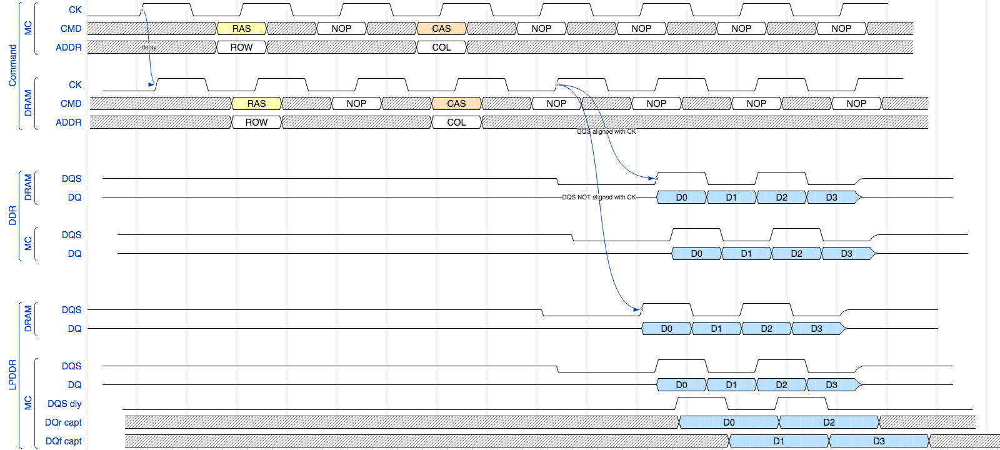

# LPDDR vs DDR

# DDR Information and Resources

## Xilinx

* [Xilinx - UG086 - Memory Interface Solutions User Guide](https://www.xilinx.com/support/documentation/ip_documentation/ug086.pdf#page=281)

    Chapter 7 describes the MIG DDR SDRAM implementation for Spartan-3E. This is probably the best place to get started.

    The source code of a MIG-generated DDR SDRAM controller for the Pano Logic Spartan-3E can be found [here](./bringup/spartan3e_ddr_ctrl).

* [Xilinx - XAPP802 - Memory Interface Application Notes Overview](https://www.xilinx.com/support/documentation/application_notes/xapp802.pdf)

    An overview of all Xilinx memory interface application notes.

* [Xilinx - Synthesizable 400 Mb/s DDR SDRAM Controller](https://www.cs.york.ac.uk/rts/docs/Xilinx-datasource-2003-q1/appnotes/xapp253.pdf#page=9)

    Contains detailed DCM implementation details for a Virtex-2 FPGA, which should be pretty similar to Spartan-3E.

* [Xilinx - System Interface Timing Parameters](https://www.xilinx.com/support/documentation/application_notes/xapp259.pdf#page=12)

    Talks about analysis of source synchronous interfaces such as DDR.

* [Xilinx - DDR SDRAM Controller Using Virtex-5 FPGA Devices - Read Data Capture Timing Calibration](https://www.xilinx.com/support/documentation/application_notes/xapp851.pdf#page=9)

    How to transfer data from DQ capture flops to internal clock domain.

* [Xilinx - UG331 - Spartan-3 Generation FPGA User Guide](https://www.xilinx.com/support/documentation/user_guides/ug331.pdf)

    Information about [DCMs](https://www.xilinx.com/support/documentation/user_guides/ug331.pdf#page=65&zoom=100,0,194), 
    [DDR IOs](https://www.xilinx.com/support/documentation/user_guides/ug331.pdf#page=328&zoom=100,0,408) etc.

* [Xilinx - UG608 - Spartan-3 Libraries Guide for Schematic Design](https://www.xilinx.com/support/documentation/sw_manuals/xilinx11/spartan3_scm.pdf)

    Describes the low level cells that can be used in an Spartan-3 design. For example, a RAM64X1S cell or a MULT18X18S cell. 

* [Xilinx - XAPP485 - 1:7 Deserialization in Spartan-3E/3A FPGAs at Speeds Up to 666 Mbps](https://www.xilinx.com/support/documentation/application_notes/xapp485.pdf)

    Not directly related to DDR, but it shows how you can design an LVDS interface with a DCM phase shifter to get the right data.

## Micron

* [Micron TN4615 - Low-Power Versus Standard DDR SDRAM](https://www.micron.com/~/media/documents/products/technical-note/dram/tn4615.pdf)

* [Micron TN0454 - High Speed DRAM Controller Design](https://www.micron.com/~/media/documents/products/technical-note/dram-modules/tn0454.pdf)

    Convers tons of aspects about how to design DRAM controllers.

* Fastest and slowest tAC and tDQSCK timing diagrams for Micron chip: see page 84 of datasheet.

    When running at fastest speed, in both cases, the risign edge of DQS falls between the same CK rising edges (at the DRAM side!), but it's close.

    There needs to be logic to compensate for this. (This logic has nothing to do with adding a 90 degree delay to DQS to capture the data at the
    receive side.)

## Example Source code

* [SpinalHDL Example SDRAM Controller](https://github.com/SpinalHDL/SpinalHDL/tree/master/lib/src/main/scala/spinal/lib/memory/sdram)

    Doesn't do DDR. Only SDR.

* [FreeCores Spartan 3E DDR Controller](https://github.com/freecores/sdram_controller)

    Uses DDR IOs and DCM to create phase clocks, but doesn't use DQS on input: that just gets ignored. Probably still good enough for slower speeds?

## General SDRAM Information

* [The Love/Hate Relationship with DDR SDRAM Controllers](https://www.design-reuse.com/articles/13805/the-love-hate-relationship-with-ddr-sdram-controllers.html)

    Interesting the history of DLL, DQS etc. in SDRAMs: why DQS is aligned the way it is for reads and writes etc.

* [Implementing an all-digital PHY and delay-locked loop for high-speed DDR2/3 memory interfaces](https://www.edn.com/design/integrated-circuit-design/4312975/Implementing-an-all-digital-PHY-and-delay-locked-loop-for-high-speed-DDR2-3-memory-interfaces)

    Talks about master/slave DLL configuration.

* [Lattice LPDDR SDRAM Controller](https://www.latticesemi.com/en/Products/DesignSoftwareAndIP/IntellectualProperty/IPCore/IPCores01/LPDDRSDRAMController)

    This data sheet of an LPDDR controller talks about read retraining due to lack of DLL inside the SDRAM. Every so many auto-refresh cycles, it does
    a bunch of reads and writes to a reserved location in DRAM location to retrain the settings.

* [Lattice DDR Interface Design Implementation White Paper](http://www.latticesemi.com/dynamic/view_document.cfm?document_id=9187)

    Talks about how to implement a DDR interface with DLLs etc.

* [High-Bandwidth Memory Interface Design](https://courses.soe.ucsc.edu/courses/ee222/Winter13/01/attachments/18097)

    Excellent course presentation about various aspects of DRAM design.

* [Synchronous DRAM Architectures, Organizations, and Alternative Technologies](https://eng.umd.edu/~blj/CS-590.26/references/DRAM-Systems.pdf)

    Overview of different DRAM architectures. Definitely dated (2002) but talks about DLLs etc.

* [Hynix DDR3 SDRAM Device Operation](https://www.skhynix.com/product/filedata/fileDownload.do?seq=2385)

    Really interesting documentation with lot of detail about DDR3 operation. See page 25 of info about DLL-off operation, which is essentially the same as
    LPDDR operation.

